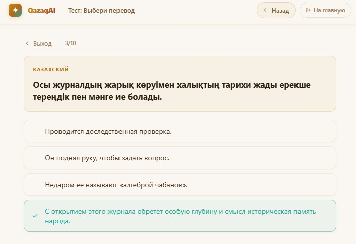
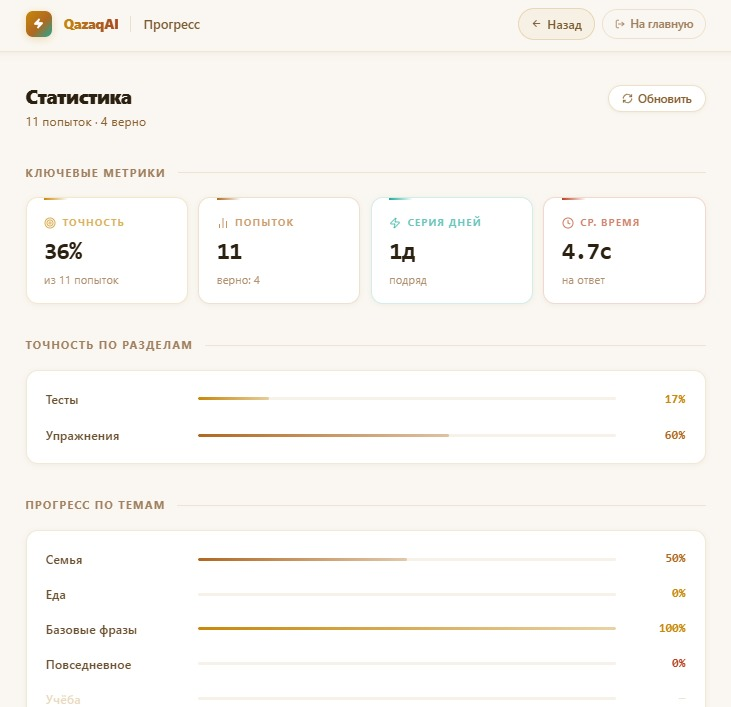

# QazaqAI — Adaptive Kazakh Language Learning Platform

Intelligent web-based learning system for structured Kazakh language acquisition with topic-level analytics and adaptive feedback.

---

## 📌 Overview

QazaqAI is a client-side adaptive learning platform designed to support systematic Kazakh language learning through:

- Vocabulary modules
- Grammar lessons
- Auto-checked exercises
- Topic-based testing
- Personal analytics dashboard

The system tracks user performance by topic, calculates accuracy metrics, and provides structured feedback based on rule-based adaptive logic.

---

## 🧠 Core Idea

Instead of random exercises, the platform:

- Aggregates attempts by topic (`category_id`)
- Calculates topic accuracy (correct / total)
- Tracks streak (daily engagement)
- Measures average response time
- Provides performance breakdown per module
- Generates participant ID for research tracking
- Allows JSON export of anonymized learning data

All analytics are computed client-side.

---

## 📸 Screenshots

### Landing Page

---

### Learning Modules

---

### Test Interface

---

### Progress & Analytics Dashboard

---

## 🎯 Key Features

- Topic-based accuracy tracking
- Rule-based adaptive recommendations
- Daily streak calculation
- Average response time analytics
- Topic performance table
- JSON export for research analysis
- Unified warm UI design system
- Fully client-side architecture (no backend required)

---

## 🏗 Architecture

### Frontend
- React (Vite)
- Component-based SPA
- View-based navigation system
- Local state management

### Data Layer
- CSV-based dataset
- Topic mapping via `category_id`
- localStorage for attempts persistence

### Analytics Layer
- Topic aggregation
- Accuracy percentage calculation
- Response-time measurement
- Participant ID generation
- Data export module

---

## 🔬 Adaptive Logic Model

The system uses a rule-based personalization strategy:

- If topic accuracy < 50% → recommended review
- If response time is high → suggest repetition
- Topics with 0 attempts remain muted in analytics
- Accuracy color coding:
  - ≥ 70% — green
  - ≥ 50% — amber
  - < 50% — red

This provides interpretable and transparent personalization.

---

📊 Research & Future Work

The platform is designed as a research prototype for intelligent educational systems.

Possible future extensions:

Machine-learning based personalization

Cloud-based storage

User authentication

NLP-driven grammar feedback

Performance prediction modeling.
